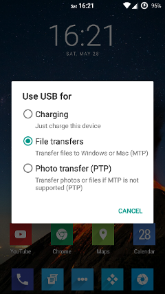
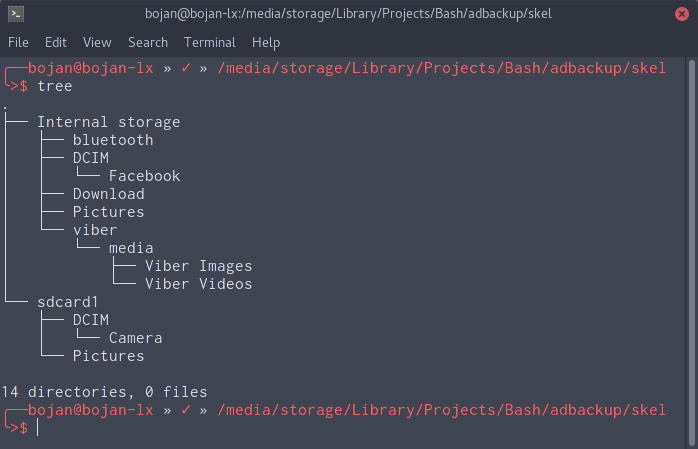

# adbackup
**Incremental backups for your Android device.**

## Prerequisites
Adbackup uses `rsync` to do incremental backups. You can install it from your favorite distribution repositories, it should be available in most Linux distributions.

Devices should be mounted with gvfs using `gvfs-mtp` package which you can also install from repositories. Gvfs is a direct dependency of Nautilus and many other file managers, so it should already be installed, unless you have KDE which uses KIO instead.

KDE users can't use this script for the time being.

## Usage
### Android side configuration:
Notification should appear after connecting device, which allows you to change connection mode.



Make sure that MTP is selected

### PC side configuration
#### Initial setup
Create a new directory which will be used as your root backup directory.  
Inside, create folder structure resembling folder structure on your Android device of folders that you want to be backed up.

For example:  
You want to backup the following folders

```
Internal storage/bluetooth
Internal storage/Download
Internal storage/DCIM/Camera
sdcard1/DCIM/Camera
```

So you make folder structure on your PC resembling that:

```
$ mkdir ~/backup_root && cd ~/backup_root
$ mkdir -p 'Internal storage/bluetooth' 'Internal storage/Download' 'Internal storage/DCIM/Camera' 'sdcard1/DCIM/Camera'
```

My sample setup:



NOTE: Only leaf directories will be synced, so if you have 'sdcard1/DCIM/Camera', only Camera folder will be backed up, but not DCIM or sdcard1.

After creating folder structure, simply run adbackup to populate directories:

```
$ adbackup.sh ~/backup_root
```

#### Incremental backups after initial setup
Simply connect your device and run:

```
$ adbackup.sh /path/to/root/backup/directory
```

## Additional options

```
-d, --device=NUM
	Specify which MTP device to use if there is more than one is connected. NUM=1 by default. Use -p option to list all devices.
-p, --print
	List all connected devices.
-r, --reverse
	Reverse operation - restore backup to device.
-h, --help
	Display help and exit.
```

## Caveat:
If doing reverse operation, permissions and timestamps cannot be preserved 
on Android device over MTP because of a bug in FUSE implementation,
so we must use `-rl --size-only` instead of `-a` rsync option.
Last tested on Android Marshmallow, and still not fixed.

This means that your pictures will all have modification date set to
current date, and may not be sorted correctly in your gallery app,
if it is set to sort by date.

Workaround is to use a card reader, and connect your SD card directly to PC.
